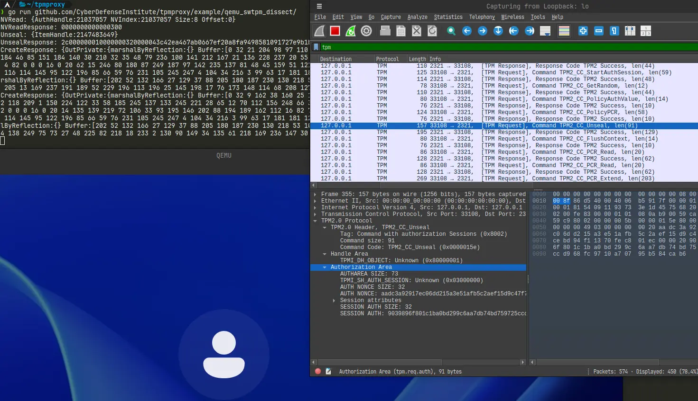

# TPMProxy

TPMProxy is a library that proxies TPM communications, makes them analyzable, and supports tampering.
It also provides several tools as usage examples of the library.

## Disclaimer

The purpose of TPMProxy is to support TPM application development and security research.
TPMProxy intentionally lowers security for communication analysis.
Do not use in a production environment.

## Features

All features are available only on Linux. Windows and Mac are not supported.

* Proxy the UNIX domain socket communication between [QEMU](https://www.qemu.org/) and [SWTPM](https://github.com/stefanberger/swtpm) to TCP communication, making it analyzable with [Wireshark](https://www.wireshark.org/).
* Assist in analyzing TPM commands and responses using [Go-TPM](https://github.com/google/go-tpm). Currently, this feature is limited, but it allows for more detailed parameter analysis than Wireshark.
* Support the tampering of TPM commands and responses. You need to implement the tampering program yourself.
* Create a virtual TPM device using [CUSE(libfuse)](https://github.com/libfuse/libfuse) and pass through to the actual TPM. It allows to analyze the communication to the actual TPM with Wireshark, analyze it with Go-TPM, and tamper with it.

## Usage example

```
$ swtpm socket --tpmstate dir=path/to/state --tpm2 --server port=2321 --ctrl type=tcp,port=2322
$ go run github.com/CyberDefenseInstitute/tpmproxy/example/qemu_swtpm_dissect@latest
$ qemu-system-x86_64 \
    ...options... \
    -chardev socket,id=chrtpm,path=/tmp/qemu_swtpm_fwd.sock \
    -tpmdev emulator,id=tpm0,chardev=chrtpm \
    -device tpm-tis,tpmdev=tpm0
```



